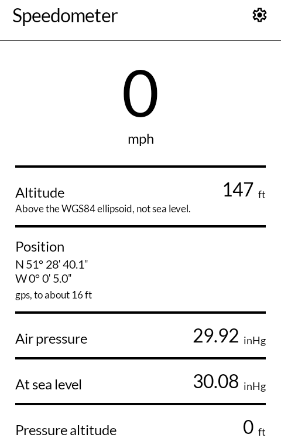
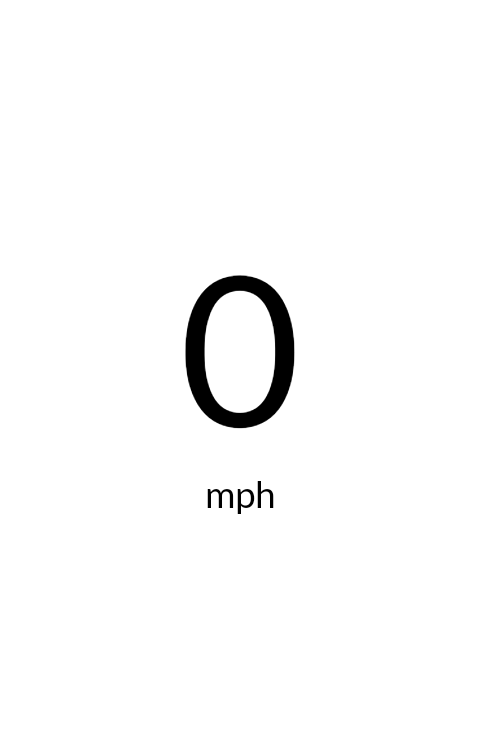
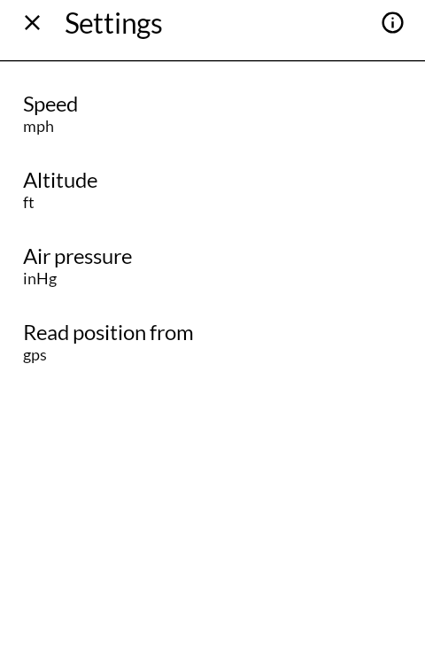
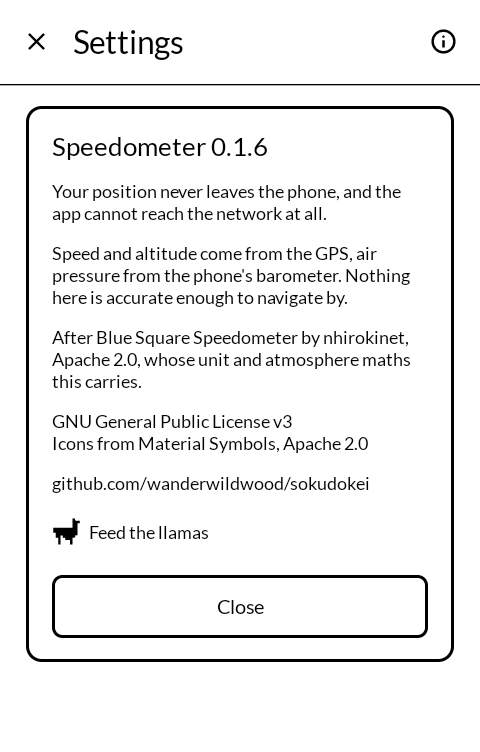

# Speedometer

速度計 *sokudokei*

How fast you are going, how high you are, and what the air is doing — on an E Ink phone,
in black and white, with nothing on the screen that is not a reading.

Built for the [Mudita Kompakt](https://mudita.com/products/kompakt/), whose 4.3" panel has
sixteen greys, a slow redraw, and is read outdoors as often as indoors.

## Screenshots

| | | | |
|---|---|---|---|
|  |  |  |  |

## What it shows

- **Speed**, in km/h, mph, knots or m/s. Press it and the number fills the screen, for a
  phone propped on a dashboard or clipped to a handlebar.
- **Altitude**, in metres or feet, from the GPS.
- **Position**, in degrees, minutes and seconds — the form you can read aloud or write
  down.
- **Air pressure**, **pressure at sea level**, and **pressure altitude**, on any phone
  with a barometer. On a phone without one, those rows are simply not there.

## What it does not do

There is no map, no history, no trip log and no account. It holds nothing between one
run and the next except which units you chose.

Your position never leaves the phone. The app requests no network permission at all, so
it could not send a fix anywhere if it were asked to.

The GPS and the barometer run only while the app is the screen you are looking at. There
is no background permission and no service.

## Two honest labels

**Altitude is above the WGS84 ellipsoid, not above sea level.** In most of the world the
two differ by tens of metres. Android can convert between them from API 34; the Kompakt
is API 31, so the conversion is not available here and the screen says which one it is
showing rather than implying the other.

**Pressure altitude is what the height would be on a standard day.** On a low-pressure
day it disagrees with the GPS altitude by a hundred metres or more. Neither reading is
broken; they are answers to different questions.

Nothing here is accurate enough to navigate by.

## Building

```
./gradlew assembleRelease
```

A release is signed by a keystore in `signing/`, which is not in this repository. Without
it the release APK builds **unsigned** and will not install anywhere — there is no
fallback key by design.

## Credit

After [Blue Square Speedometer](https://github.com/nhirokinet/bluesquarespeedometer) by
nhirokinet, Apache License 2.0, from which this carries the unit conversions and the
standard-atmosphere maths. That author chased every conversion factor to a standards
document rather than a search result, and those references are kept in the source where
the numbers are used.

The interface is a rebuild rather than a reskin: this is Jetpack Compose against
[MMD](https://github.com/mudita/MMD), Mudita's E Ink component library, where the
original is Android views.

Icons are [Material Symbols](https://fonts.google.com/icons), Apache License 2.0.

## Support

This is free software and it stays free; there is nothing here to buy. If you would like to
send something somewhere anyway, there are some llamas who go through a great deal of hay:
<https://hotspringsllamas.org/donate/>

## Licence

GNU General Public License v3.0 only. See [LICENSE](LICENSE).

Copyright © wander wildwood.

This program incorporates work from Blue Square Speedometer, Copyright © nhirokinet,
licensed under the Apache License 2.0, which is compatible with and relicensed under the
GPL v3 here as that licence permits.
